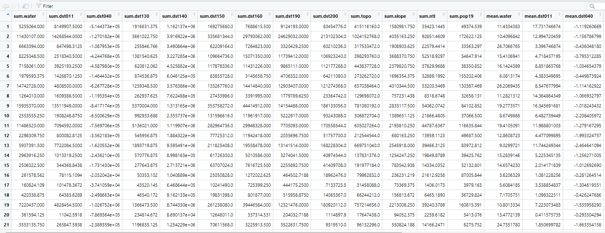
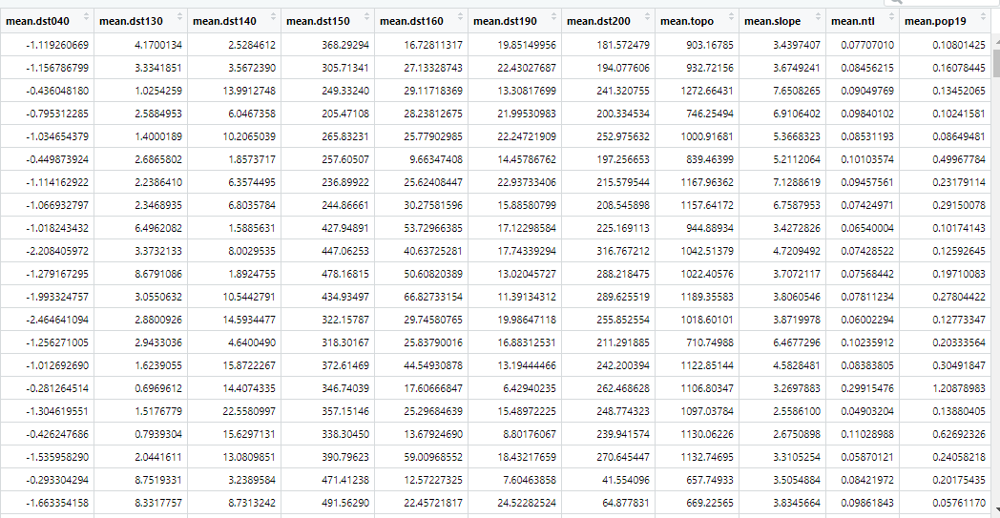

# March_22_Informal_Response

For each of the following three steps you only need to download the administrative subdivisions, and their associated files not complete the entire exercise.
Download the administrative subdivision for your selected country. Download GADM ADMs

Download the population raster from Worldpop for your selected county following these instructions. 
Download population geospatial raster from Worldpop
Download the 12 rasters from your selected country and stack them following these instructions. 
Downloading geospatial rasters from Worldpop
Produce a raster stack and calculate summary statistics using the script posted to our slack channel

Raster stack summary statistics for ADM3:
I couldn't figure out how to get the entire table into one image so I just decided to split it into two pieces.

